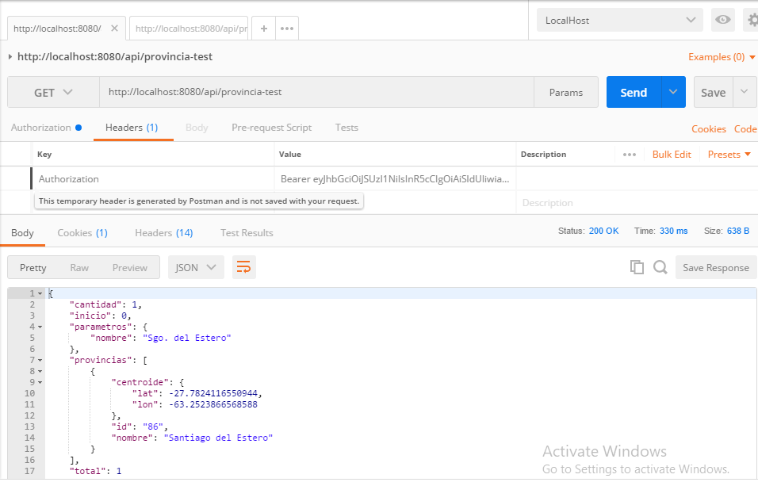
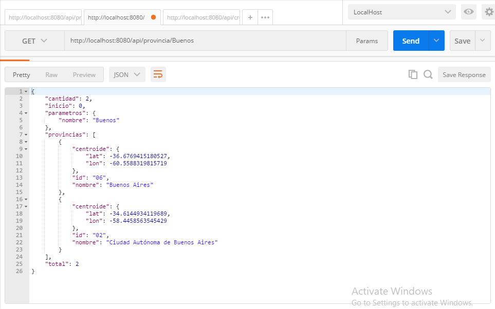
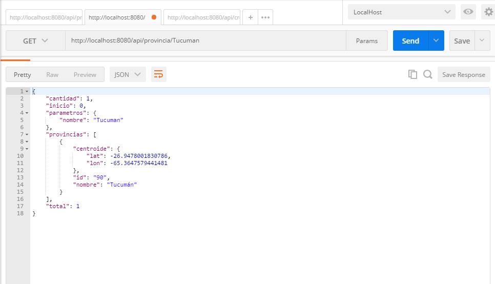
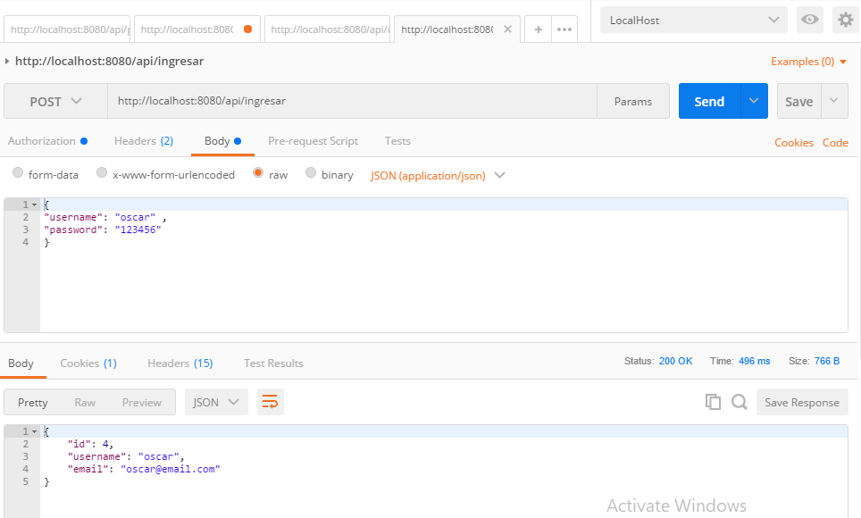

# Spring Boot Login + H2 

- Login
- H2 Data Base
- JPA
- Hibernate
- Como correr la Aplicacion
- Postman

## Proceso de Registracion, Login y Autorizacion.


## Base de datos H2

> [http://localhost:8080/h2-ui](http://localhost:8080/h2-ui)

## Configure Spring Datasource, JPA, App properties
Open `src/main/resources/application.properties`

# Hibernate ddl auto (create, create-drop, validate, update)
spring.jpa.hibernate.ddl-auto= update

# App Properties
bezkoder.app.jwtSecret= bezKoderSecretKey
bezkoder.app.jwtExpirationMs= 86400000
```
# App Properties
bezkoder.app.jwtSecret= bezKoderSecretKey
bezkoder.app.jwtExpirationMs= 86400000
```
## Run Spring Boot application
```
mvn spring-boot:run
```

# Postman


##

##

##

